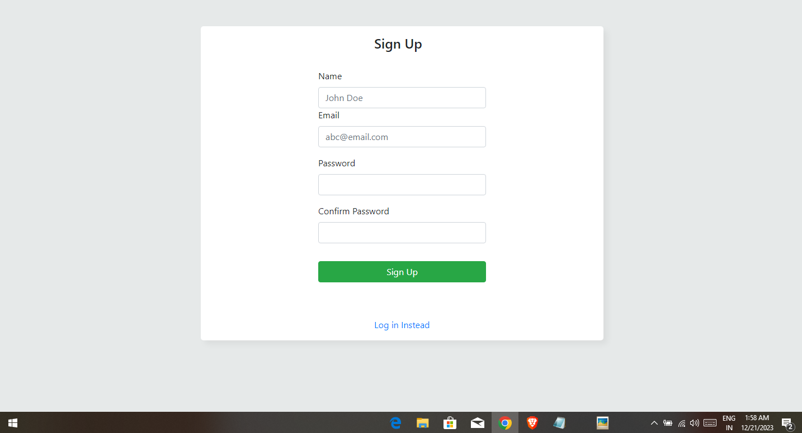
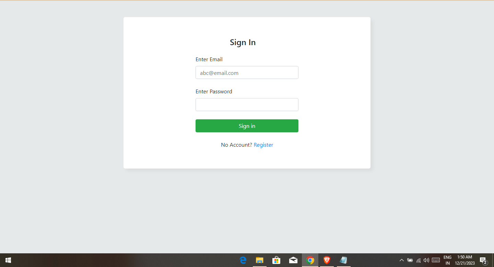
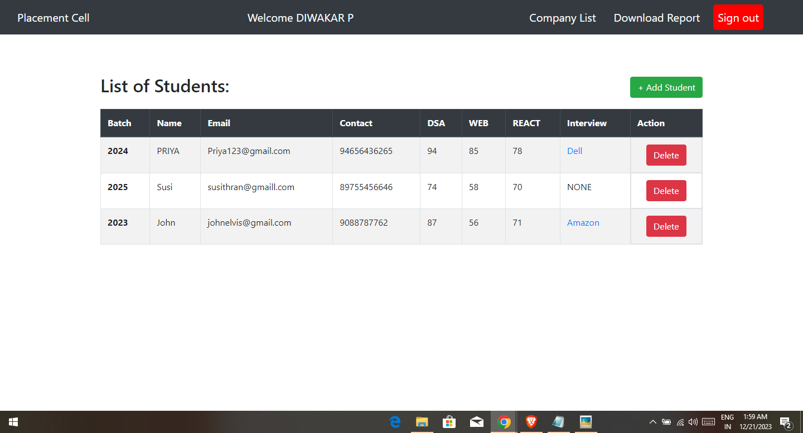
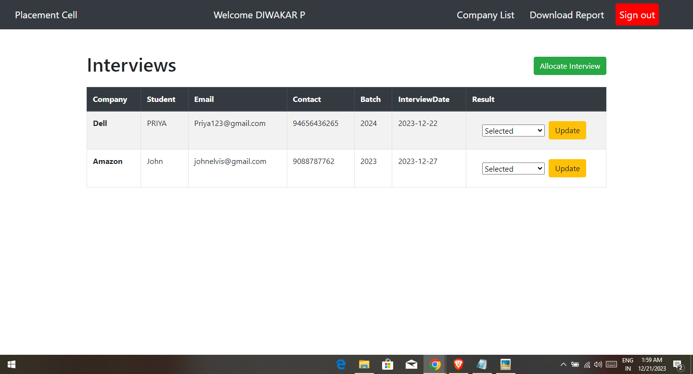
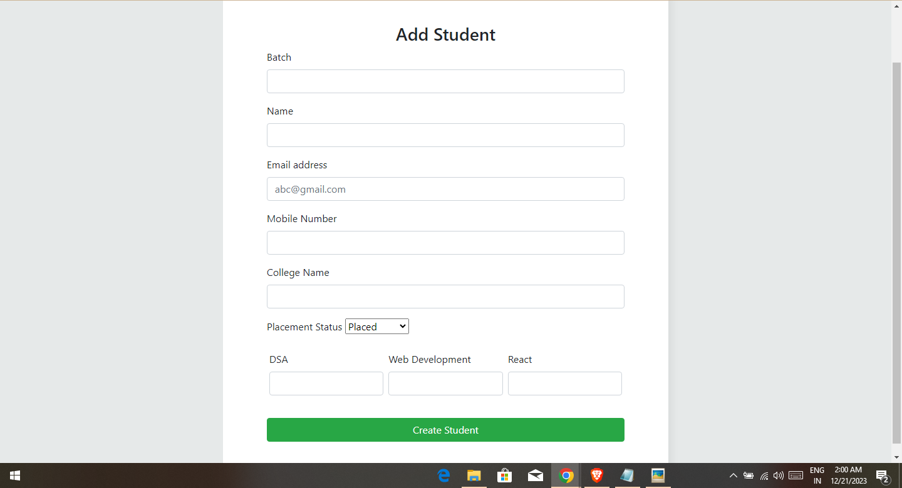
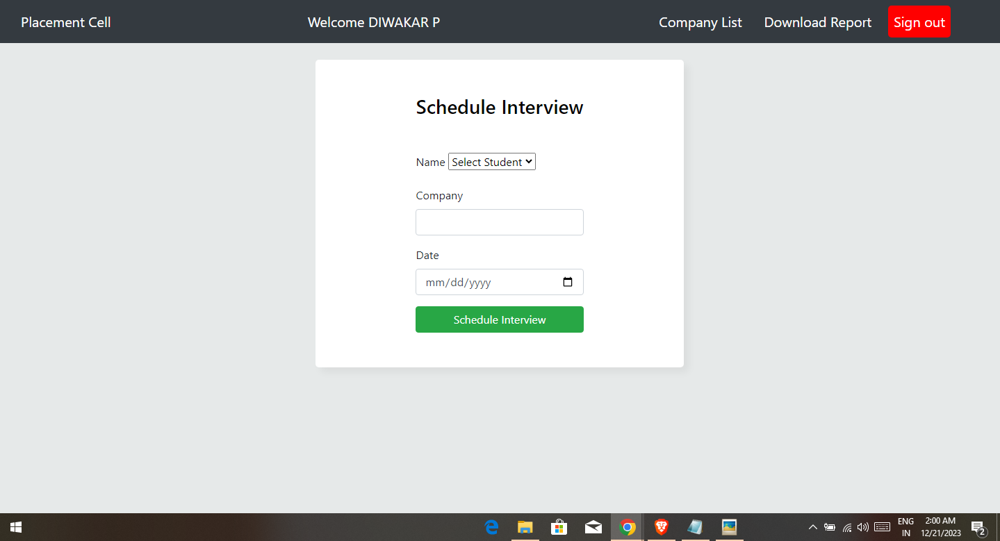
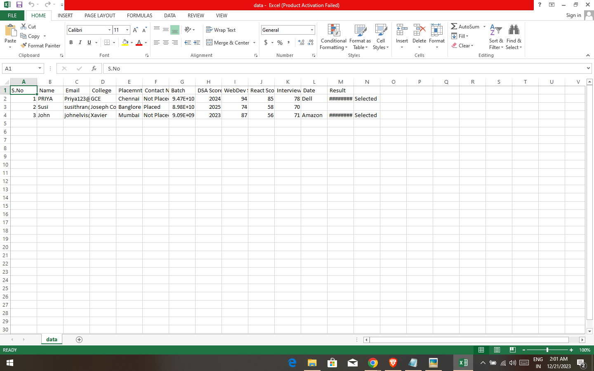

# NodeJS-Placement-Cell
 <h1 align="center">Placement Cell  📝</h1> 

 🖊️ A Web Portal for placement cell Company to keep records of students and schedule interviews with different companies  
 

<h1 align="center">

`Host Link : https://placement-tl1y.onrender.com/`

</h1>

## Features

- Sign up / Sign in forms for employees
- Add a new student to the list of students
- Allocate and schedule interview with different companies and update their result status
- Download reports of students in csv format

## Screenshots

- Sign Up
  

- Sign In
  

- Student Page
  

- Interview Page
  

- Add student
  

- Schedule Interview
  

- CSV Report
  

## Setup

Run `npm install` to install required dependencies

Environment Variables:

- PORT = [Your Port]
- SECRET = [Your Secret]
- MONGO_URI = [Your MongoDB Ur]
